# Zype Amazon Fire TV Recipe

This document outlines step-by-step instructions for creating and publishing an Amazon Fire TV app powered by Zype's Endpoint API service and app production software and SDK template.

## Requirements and Prerequisites

### Technical Contact
IT or developer support strongly recommended. Completing app submission and publishing requires working with app bundles and IDE.

### Zype Amazon Fire TV Endpoint License
To create a Zype Amazon Fire TV app you need a paid and current Zype account that includes purchase of a valid license for the Zype Amazon Fire TV endpoint API. Learn more about [Zype's Endpoint API Service](http://www.zype.com/services/endpoint-api/).

### An Amazon Developer Account
You may sign up for a Amazon Developer account via [Amazon's website](https://developer.amazon.com/appsandservices).

### Amazon Fire TV or Fire TV Stick with the Amazon Web App Tester installed
An Amazon Fire TV or Fire TV Stick with the Amazon Web App Tester installed is required for previewing and testing the app. A Fire TV or Fire TV Stick may be purchased on Amazon.com. The Amazon Web App Tester may be downloaded from the Amazon App Store.

## Creating a New App with the SDK Template

### Generating your app bundle

1. In order to generate an Amazon Fire TV app bundle using this SDK, you will need to first create an Amazon Fire TV app on the Zype platform. If you have not done this yet, log in to your Zype account [here](https://admin.zype.com/users/sign_in), and click on the __Manage Apps__ link under the __Publish__ menu in the left navigation. You will see a button to create a new app. Continue following the instructions provided within the app production software.
1. Once you have your Amazon Fire TV app created in the Zype platform, click on __Get New Bundle__ and the configured app bundle will be emailed to you. You may also reload the page and click the __Download Bundle__ button.

## Previewing and testing your new app

After you've received your app bundle, you'll need to preview and test your new app using Amazon's Web App Tester. There are 2 options:

### Option 1 - Upload the beta app to your own web host
_Note: This option requires third-party SSL web hosting and, in some cases, a domain name. A developer's assistance is recommended for this option._ 

1. Unzip the beta app package archive downloaded from Zype
1. Upload the files to a web host of your choice (examples of common web hosts include Amazon S3, MediaTemple, GoDaddy, Network Solutions, etc.)
1. Copy the HTTP link to the app's index.html file
1. Open the "**Web App Tester**" app on your Fire TV
1. In the top right corner, make sure it's set to "`TEST HOSTED APP`" (*Note: it should default this way*) (Fig. 1)
	
	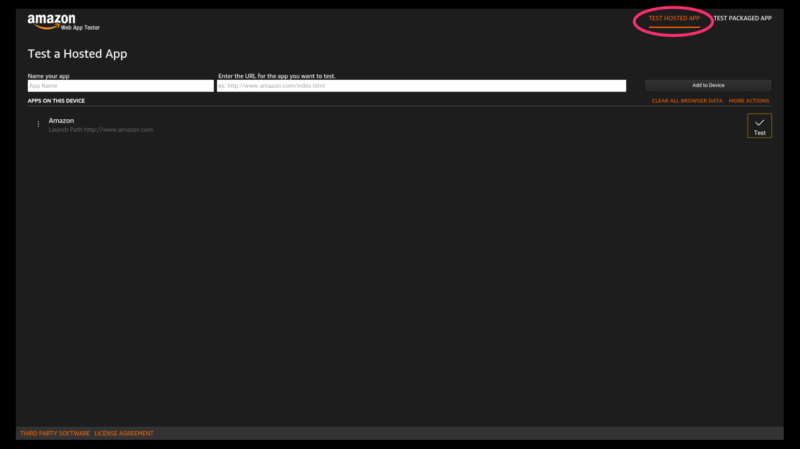
1. Click "`Name Your App`" (Fig. 2)
	
	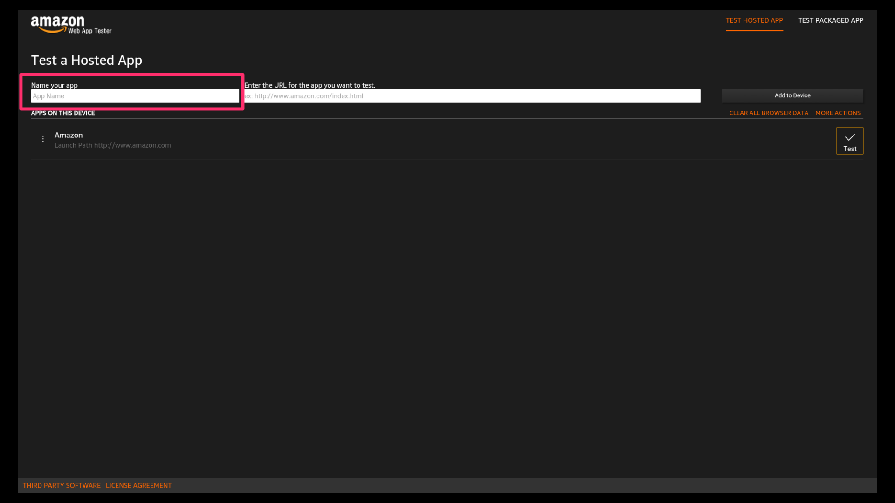
1. Enter the app name you want and click "`Submit`" (*Note: this is for internal use only and won't be seen anywhere else*)
1. Enter the URL copied in Step 3 (Fig. 3)
	
	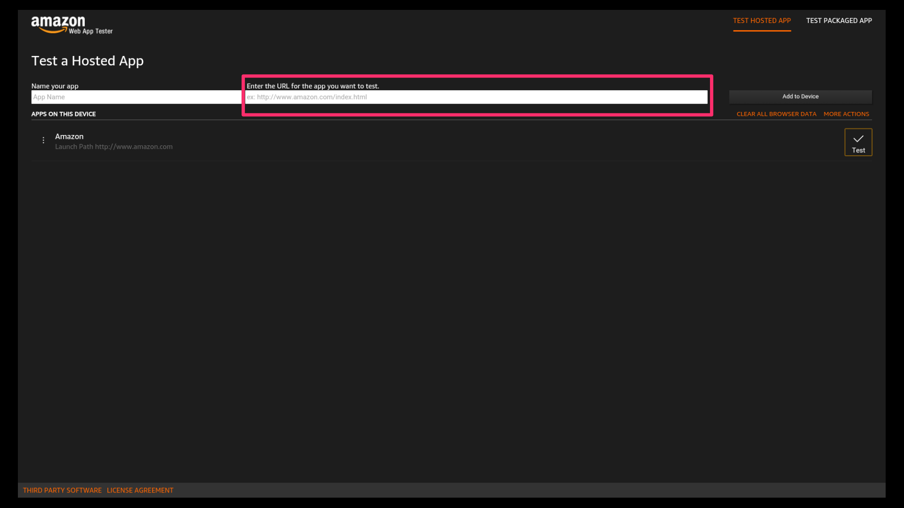
1. Click "`Submit`"
1. Click "`Add to Device`"
1. Your app will appear in the list below
1. Scroll down and click "`Test`" to the left of your app (Fig. 4)
	
	
1. Your app will open

### Option 2 - Create a Local Web Server on your computer
_Note: These instructions apply to specifically to macOS, however, the principles are applicable to any operating system (Windows, Linux, etc). A developer's assistance is recommended for this option._

1. Unzip the beta app package archive downloaded from Zype
1. In Finder, navigate to the folder containing the app and copy it (`command + c`)
1. Open the Terminal app.
1. At the prompt, type `cd`, space, then paste the folder copied in Step 2 (`command + v`).
	
	```
	cd /Users/user1/Desktop/zype-aftv
	```

1. In Terminal, start a HTTP server using the following command
	
	```
	python -m SimpleHTTPServer
	```
	
1. Open `System Preferences > Network > Status` to find your IP Address
1. Note the IP Address
1. Make sure both your computer and Fire TV are connected to the same wireless network
1. Open the **Web App Tester** app on your Fire TV
1. In the top right corner, make sure it's set to "`TEST HOSTED APP`" (*Note: it should default this way*) (Fig. 1)

		
	
1. Click "`Name Your App`" (Fig. 2)
	
	
1. Enter the app name you want and click "`Submit`" (*Note: this is for internal use only and won't be seen anywhere else*)
1. Enter the IP Address from Step 6, prepending `http://` and appending :`8000/index.html` (example: `http://192.168.1.1:8000/index.html`) (Fig. 3)
	
	
1. Click "`Submit`"
1. Click "`Add to Device`"
1. Your app will appear in the list below
1. Scroll down and click "`Test`" to the left of your app (Fig. 4)
	
	
1. Your app will open
1. Press (`Control + C`) to stop the HTTP server when you have completed testing

## Submitting to the Amazon Store
### Take screenshots of the app
In order to submit your Amazon Fire TV app to the Amazon Appstore, Amazon requires 3-10 screenshots of your app: 1920px x 1080px (landscape) in PNG or JPG format. *Note: Below, Option 1 is strongly recommended. A developer's assistance is highly recommended for both options.*

#### Option 1: Follow Amazon's instructions (recommended)
##### Amazon's Instructions
[https://developer.amazon.com/public/support/submitting-your-app/tech-docs/taking-screenshots](https://developer.amazon.com/public/support/submitting-your-app/tech-docs/taking-screenshots)

#### Option 2: Preview your Fire TV beta app on your computer
*Note: These instructions are for macOS specifically, but the same principles can be applied to any operating system (Windows, Linux, etc.). Both a developer and a designer are recommended for this workaround option.*

##### Prerequisites
* Plain-text editor app ([Sublime Text](https://www.sublimetext.com/), [Text Wrangler](http://www.barebones.com/products/textwrangler/), [Atom](https://atom.io/))
* Image editing app ([Photoshop](http://www.adobe.com/products/photoshop.html), [Sketch](https://www.sketchapp.com/), [Gimp](https://www.gimp.org/))

##### Take the screenshots
1. Unzip your beta Fire TV app package archive downloaded from Zype. This is your Fire TV app.
1. In the app folder, open `/js/init.js` in a plain text editor.
	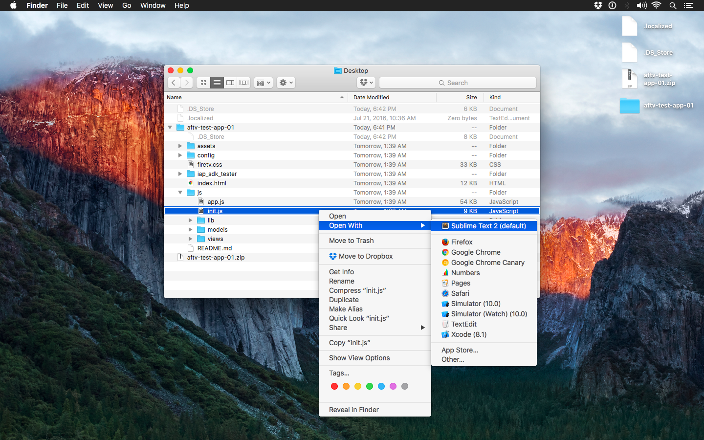
1. In `init.js`, find the line that reads "`// initApp(settings);`". It should be directly underneath the line that reads "`// uncomment to test on the browser`"
		
	```
	// uncomment to test on the browser
	// initApp(settings);
	```
	
	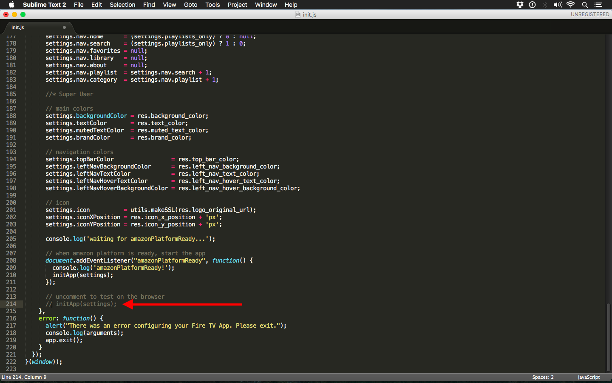
	
1. Delete the two forward slashes at the beginning of this line. The line should now read "`initApp(settings)`". Save the file (`Command + S` or `File > Save`).

	```		
	// uncomment to test on the browser
	initApp(settings);
	```
	
	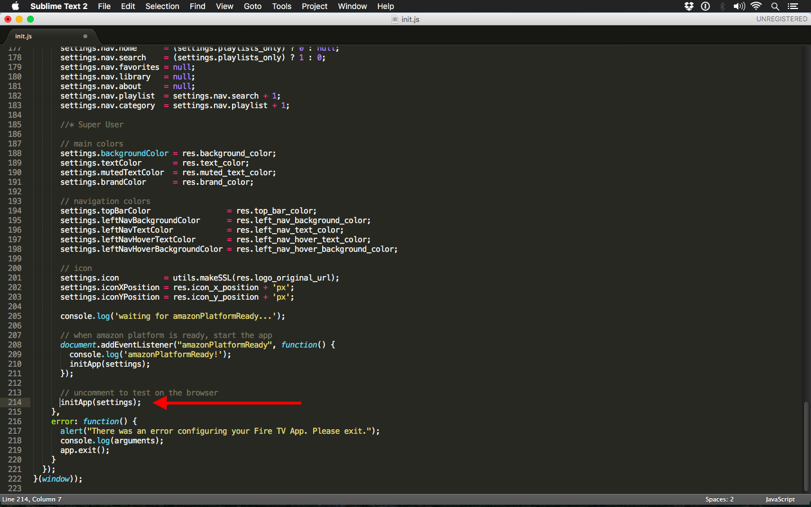
1. Open `index.html` in a web browser (Google Chrome or Safari is recommended). Maximize the web browser window so it fills the entire screen.
	
	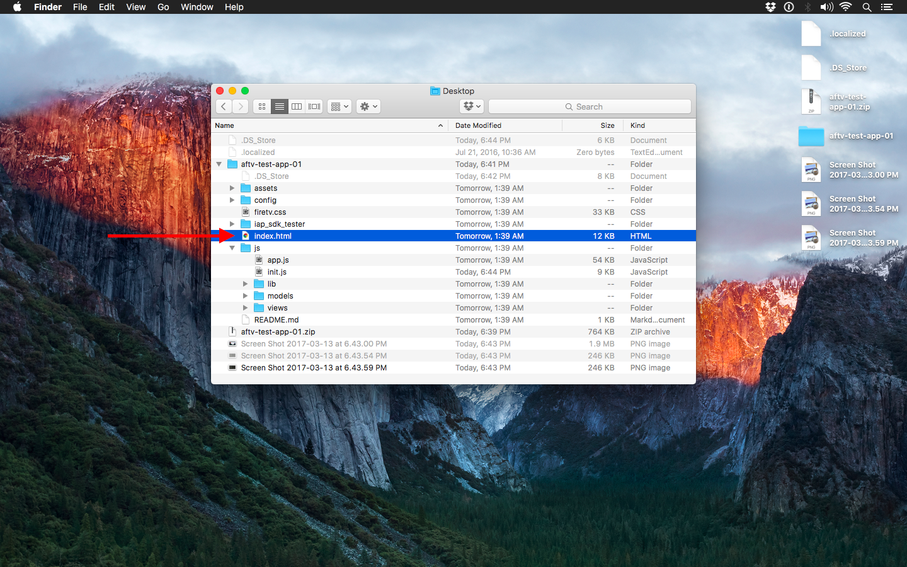
1. When `index.html` opens in the web browser, the app's circular loading indicator will most likely be off-center. This is due to differences in your computer screen's resolution compared to the Fire TV's native resolution, 1920px x 1080px.
	
	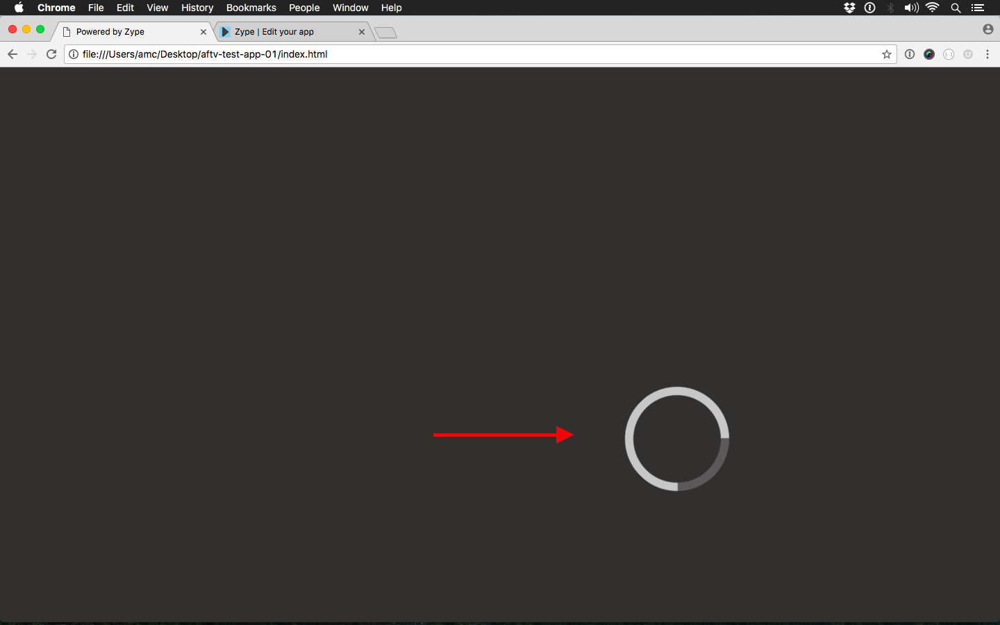
1. If your computer screen's resolution is less than 1920x1080, you'll need to Zoom Out in your web browser until the loading indicator is centered within the screen. Go to `View > Zoom Out`.
	
	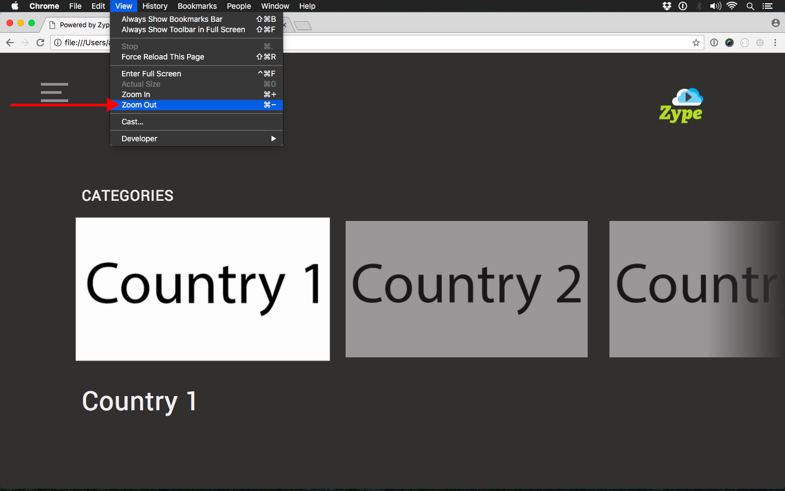
1. Reload the page (`Command + R` or `View > Reload This Page`) and check if the loading indicator is centered. Repeat Steps 7 & 8 until the loading indicator is centered in the screen.
	
	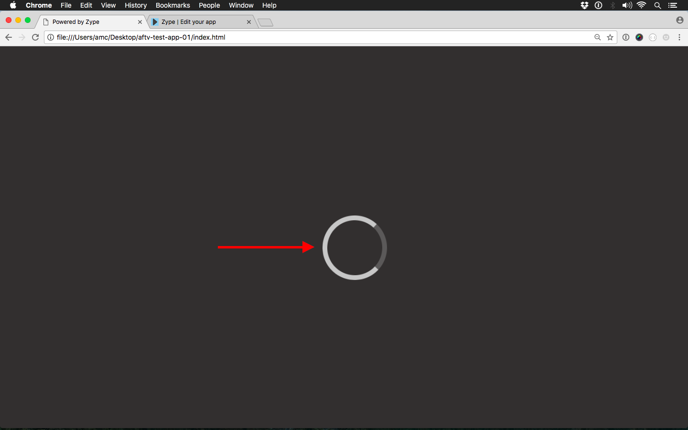
1. Navigate through your app using your keyboard (Arrows: `left`, `right`, `up`, `down`, `delete/backspace`, and `return/enter`). Take at least 3 unique screenshots (`Command + Shift + 3`).
	
	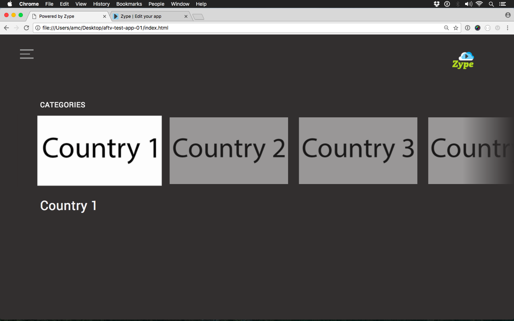
1. Open an image editing app and create a new 1920 x 1080px file. (*Note: Example shows Photoshop*).
	
	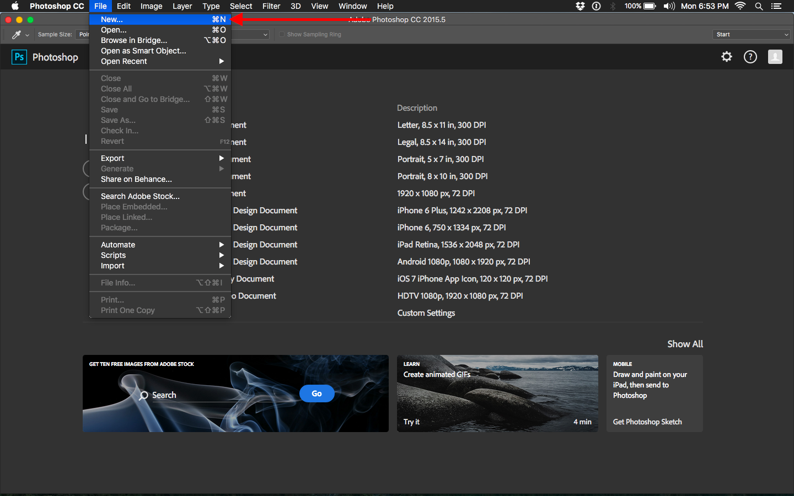
1. Open the screenshot in the image editor. Select the layer.
	
	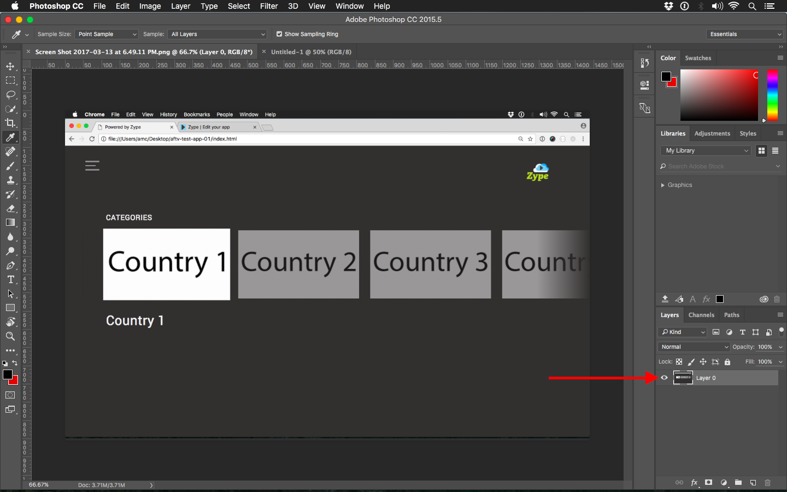
1. Crop the top and bottom of the screenshot, removing the non-app portions of the screenshot using the Crop tool.
	
	
1. Duplicate the selected layer to the new 1920x1080 file you created (`Layer > Duplicate Layer...`)
	
	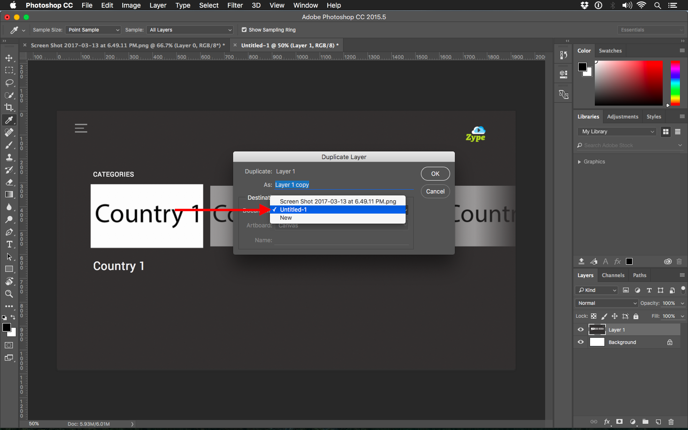
1. Switch to the 1920x1080 file's tab and select the newly duplicated layer.
	
	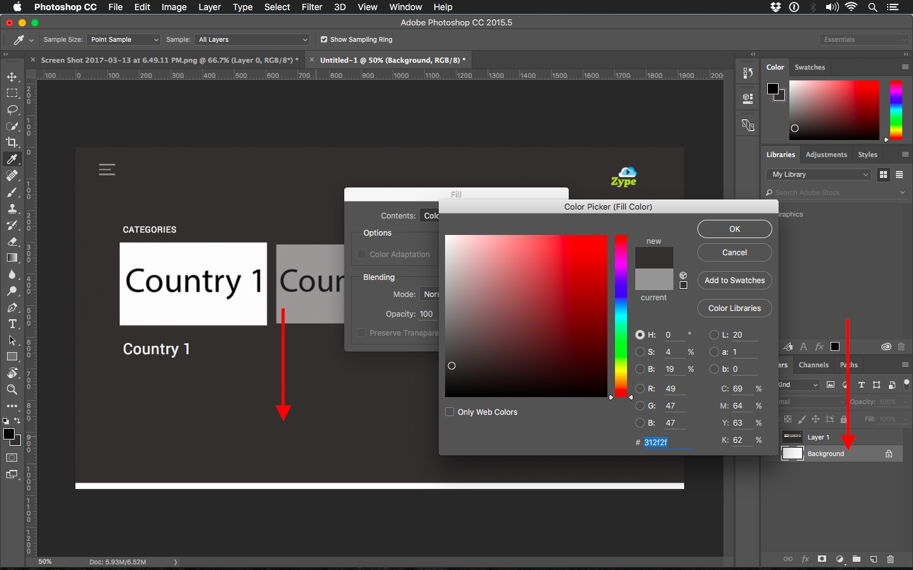
1. Transform the layer (`Edit > Free Transform`)
	
	
1. Choose the top-left Reference Point Location. Click the "`Maintain Aspect Ratio`" button. In the `Width` field, type `1920px`. Click the `Commit Transform` button (check mark icon) to apply the transform.
	
	
1. Fill the Background Layer with the app's background color.
	* Select the Background Layer which was created when the 1920x1080 file was initially created.
	* Go to `Edit > Fill` — the "Fill" dialog opens.
	* In the "Contents" drop-down menu, select "`Color...`" — the "Color Picker" dialog opens.
	* Move your mouse over a portion of the screenshot which shows the app's background color (the mouse cursor becomes an eye-dropper icon). Click to select the background color.
	* Click the OK button on the "Color Picker" dialog.
	* Click the OK button on the "Fill" dialog.
	
	
1. Export the file as a PNG. `File > Export > Quick Export` as PNG.
	
	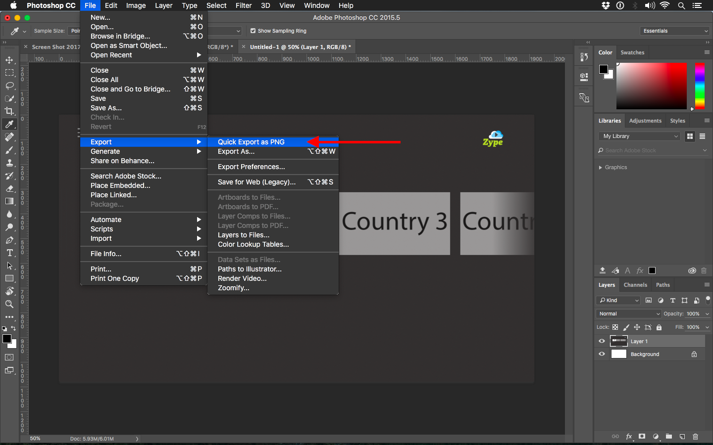
1. Repeat Steps 11 - 16, 18 as needed.
